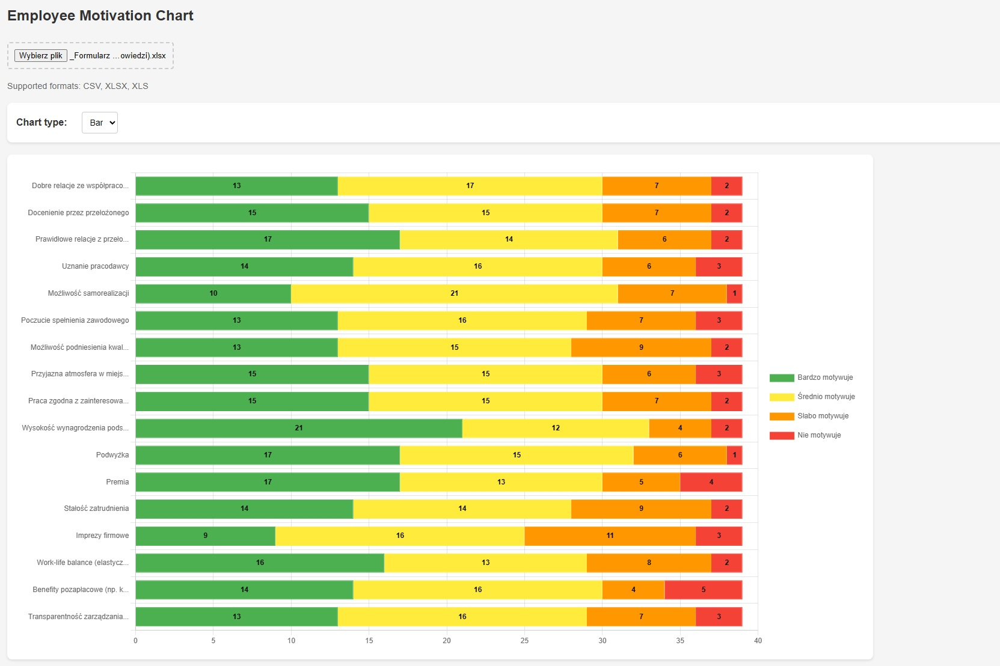

# Chart-Gen-JS

Aplikacja webowa do generowania interaktywnych wykresów z plików Excel (XLSX) i CSV.

## Funkcjonalności

- Wsparcie dla plików XLSX i CSV
- Automatyczne wykrywanie i przetwarzanie danych ankietowych
- Dwa typy wykresów:
  - Wykres słupkowy (poziomy, skumulowany)
  - Wykres kołowy
- Interaktywne etykiety pokazujące:
  - Liczby odpowiedzi na środku słupków
  - Procenty w wykresie kołowym
- Responsywny interfejs
- Dynamiczne generowanie kolorów
- Obsługa polskich i angielskich odpowiedzi
